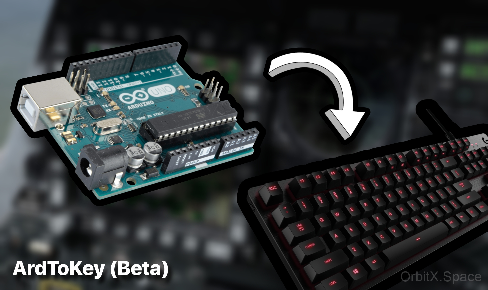

***

**Installation** 

1. Install or Run all the files inside the "Redist" folder. (Skip this step if already installed)
2. Run the windows batch files "pyserial.bat" & "pyautogui.bat". (Installation of required libraries)
3. Head to "ArdToKey.ino" file & upload the sketch to your Arduino board.
4. Run the "Start_Serial_Keyboard.bat" file.
5. Enjoy!

***

**Troubleshooting**

$ If u will to change the key mapped to the switch, then go to the "sketch.ino" file inside the Sketch folder and edit the key already mapped to your key which you wish to. (Beta Version, GUI updates coming soon)

$ In case Serial Keyboard doesn't work, you may have to replace the COM Port with the correct port and baud rate on which the Arduino runs.

$ You can find your correct COM Port and baud rate in the Arduino IDE.	

$ Take a look at the images in the "Troubleshooting" folder to fix your COM Port & baud rate issues (if any

***

**Author: OrbitX.Space**
